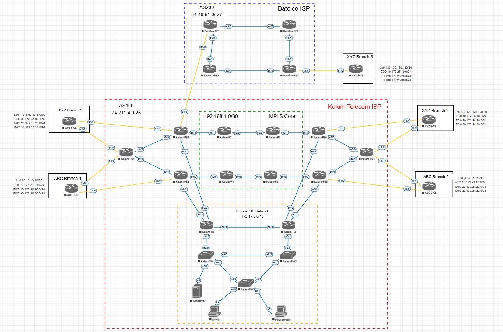

# IT7099-Kalam-Telecom-Internet-Service-Provider
This repository contains all the files created throughout the **Kalam Telecom Internet Service Provider** Project

---

## What is included in this repository 

### 1) Network Configurations
Full CLI configurations, backups, and device-specific files across Kalam Telecom Infrastructure
- Customer Sites
- Kalam Telecom Sites (MPLS Backbone and internal network)
- Batelco Site
These configs include routing protocols, MPLS, MPLS VPN, security controls, and verification states.

### 2) Reports
Includes all the reports produced throughout the project

### 3) Network Design Documentation
- **Network Topology**— Visual map of Kalam Telecom Infrastructure. 
- Network Documentation explaining layout, addressing, and design decisions.

## Purpose

The goal of this project is to demonstrate real-world carrier-grade ISP routing with MPLS:
- Scalable routing protocols (OSPF, EIGRP, MP-BGP)
- Label Switching Technique (MPLS)
- Inter-AS MPLS VPN Network
- IP addressing

## How to Use This Repository 

**If you’re studying or reviewing this project:**
1. Open the **Network Topology** diagram to understand Infrastructure layout.
2. Load the appropriate configurations into your simulator of choice.
3. Use the CLI configs to step through:
   - Routing
   - Security
   - Connectivity checks
4. Compare your own setup against the configs in the Repository.

## Recommended Tools

- **EVE-NG** for topology/simulation
- Cisco CLI (IOL)  
- Ping, traceroute, and **show/debug** commands for verification

**All work in this Repository was completed by Hasan Bahzad (ID 202001980) Networking Student At Bahrain Polytechnic
