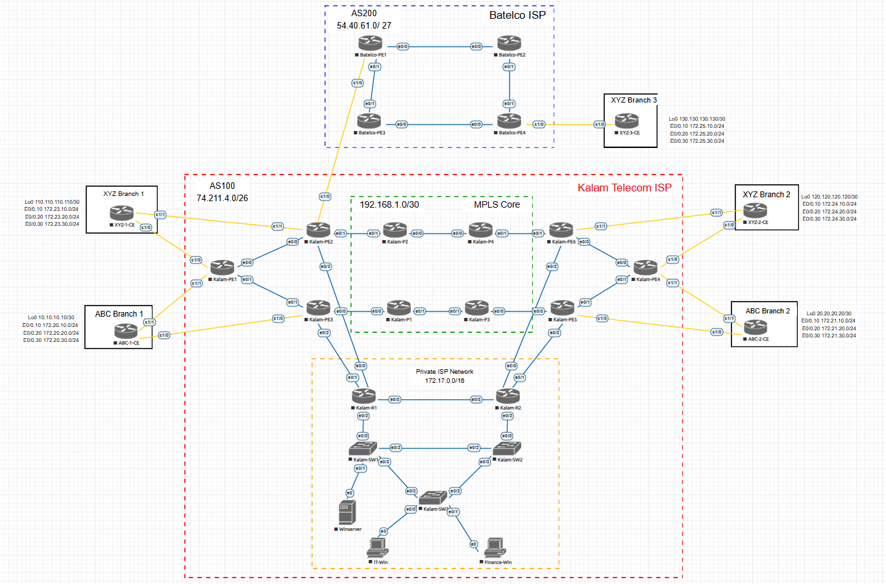

# 🌐 Kalam Telecom — ISP Network Simulation (MPLS L3VPN + Inter-AS)

> A carrier-grade ISP network simulation built in EVE-NG, featuring MPLS L3VPN,
> Inter-AS MPLS connectivity, and multi-customer VPN services.

---

## 📖 Overview

This repository contains the full design, configuration, and documentation of a
simulated **MPLS-based Service Provider network** built in EVE-NG as part of the
IT7099 capstone project.

The topology models **Kalam Telecom** as the core ISP, serving two enterprise
customers over an **MPLS L3VPN** backbone, while maintaining **Inter-AS MPLS**
peering with an external ISP (**Batelco**). The project reflects real-world
carrier-grade network engineering practices.

---

## 🗺️ Network Topology



---

## ✨ Key Features

| Feature | Details |
|---|---|
| **MPLS L3VPN** | Two isolated customer VPNs over a shared backbone |
| **Inter-AS MPLS** | Option B peering with external ISP (Batelco) |
| **Routing Protocols** | OSPF (backbone IGP), EIGRP (customer sites), MP-BGP (VPN signaling) |
| **Label Switching** | Full LDP-based MPLS forwarding |
| **Security Controls** | ACLs and Route-Maps for traffic filtering and policy |
| **Simulation Platform** | EVE-NG with Cisco IOL images |

---

## 📁 Repository Structure

```
├── Config/
│   ├── ABC/
│   ├── XYZ/
│   ├── Kalam Telecom/
│   └── Batelco/
├── Show Run
│   ├── ABC/
│   ├── XYZ/
│   ├── Kalam Telecom/
│   └── Batelco/
├── Kalam Telecom Internet Service Provider MPLS-Final.zip
├── Documentation/
│   ├── IP Addressing Table.pdf
│   ├── Kalam Telecom Network Design Document.pdf
│   └── Topology.png
└── Reports/
    ├── Thesis.pdf
    ├── Project Charter.pdf
    ├── Project Plan.pdf
    └── Final Demo Presentation.pdf
```

---

## 🔧 What's Included

### 1. Network Configurations
Full CLI configurations for every device in the topology:
- PE, P, and ASBR router configurations (Kalam Telecom)
- Customer edge (CE) router configurations for both customers
- Batelco inter-AS peering configuration
- MPLS LDP and MP-BGP setup
- VRF definitions and route distinguishers (RD) / route targets (RT)
- Security policies (ACLs, Route-Maps)
- Verification command outputs (`show ip route vrf`, `show mpls forwarding-table`, etc.)

### 2. EVE-NG Topology File
- Complete `.unl` lab file — ready to import directly into EVE-NG
- All device roles and links pre-configured

### 3. Network Design Documentation
- Full IP addressing plan (loopbacks, links, customer subnets)
- VRF and VPN topology breakdown
- Inter-AS architecture diagram and peering design
- Visual network topology map

### 4. Academic Reports
- **Thesis** — Full academic writeup of the project
- **Project Charter** — Scope, objectives, and deliverables
- **Project Plan** — Timeline and milestones
- **Demonstration Slides** — PPT used for project presentation

---

## 🚀 How to Use This Repository

### Option A — Study & Review
1. Start with the **Network Topology** diagram to understand the infrastructure layout.
2. Read the **Network Design Document** for IP plans and VRF/VPN design decisions.
3. Browse device configs to understand how MPLS, VRFs, and BGP are configured end-to-end.

### Option B — Lab Reproduction
1. Install and launch **EVE-NG** (Community or Pro).
2. Import `Kalam-Telecom.unl` into your EVE-NG lab folder.
3. Assign the correct **Cisco IOL** images to router nodes.
4. Boot devices and load configs from the `Configurations/` folder.
5. Verify the network using the commands below.

---

## ✅ Verification Commands

```bash
# MPLS label forwarding
show mpls forwarding-table
show mpls ldp neighbor

# VPN routing
show ip route vrf <VRF_NAME>
show bgp vpnv4 unicast all summary

# Inter-AS peering
show bgp vpnv4 unicast all neighbors
show ip bgp summary

# End-to-end reachability
ping vrf <VRF_NAME> <destination-IP>
traceroute vrf <VRF_NAME> <destination-IP>
```

---

## 🛠️ Tools & Technologies

| Tool | Purpose |
|---|---|
| EVE-NG | Network simulation platform |
| Cisco IOL (IOS on Linux) | Router images |
| MP-BGP | VPN route distribution |
| OSPF | Backbone IGP |
| EIGRP | Customer site routing |
| LDP | MPLS label distribution |

---

## 📚 Learning Objectives

This project demonstrates:
- How ISPs build scalable **MPLS L3VPN** services for enterprise customers
- The role of **PE, P, and CE routers** in a VPN architecture
- How **Inter-AS MPLS** enables VPN extension across multiple ISP domains
- Route policy control using **Route-Maps and ACLs**
- End-to-end traffic engineering and **VRF isolation**

---

## 👤 Author
**[Hasan Bahzad]**
IT7099 Capstone Project
[Bahrain Polytechnic / Networking]
